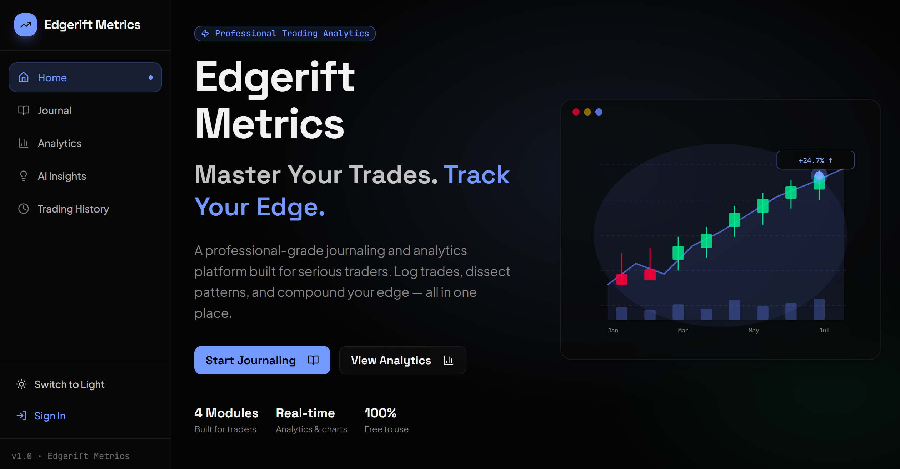
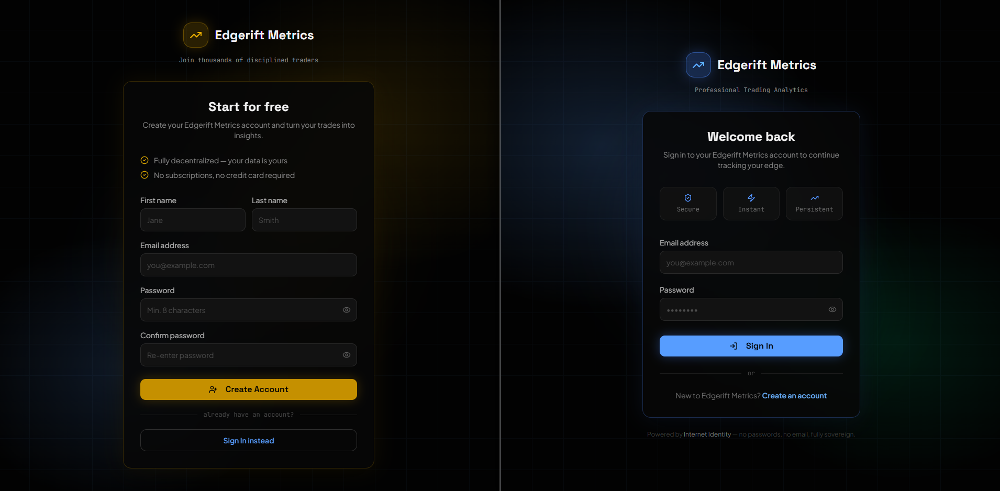
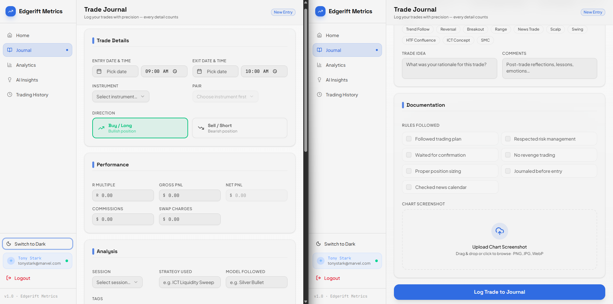
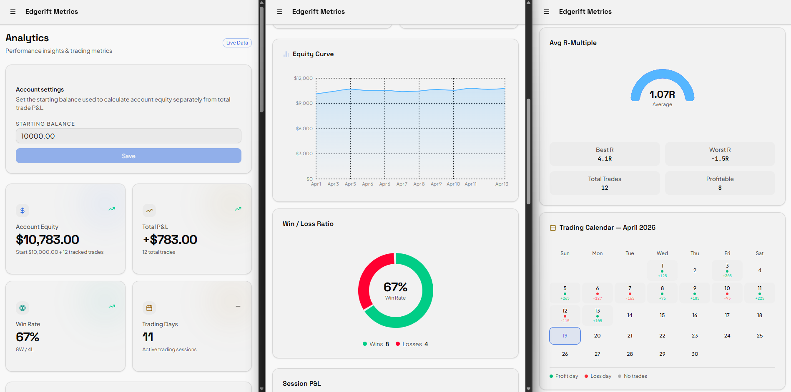
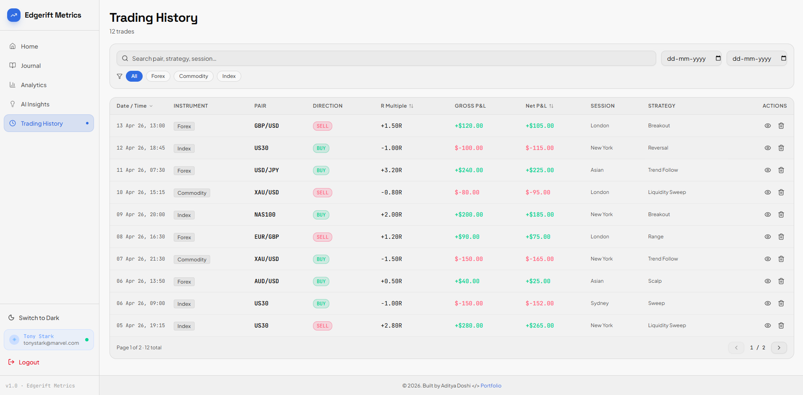
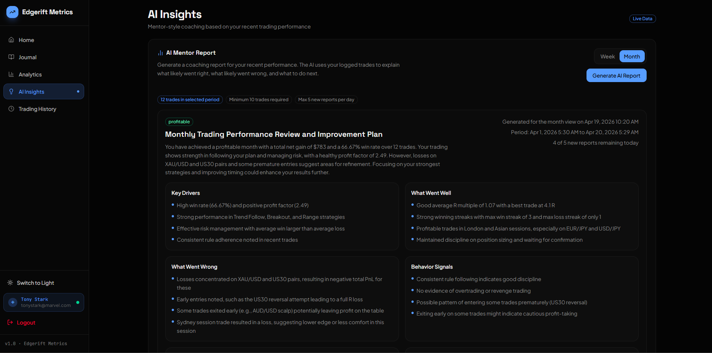

# EdgeRift Metrics

## What it does?

EdgeRift Metrics is a full-stack trading journal and performance analytics app built for traders who want to log executions, review historical performance, and generate AI-assisted coaching summaries from real trading data.

## Technical Descisions

The repository is organized as a Turborepo monorepo which helps optimizing workflows with a React frontend, an Express API, and shared workspace packages for contracts, UI primitives, and TypeScript configuration.

## Feature Highlights (Results)

- Authentication: Email/password registration and login with JWT-based protected API routes.
- Trade journaling: Structured trade entry with validation, normalization, comments, tags, rules followed, and optional chart screenshots.
- Trading history: Filterable and deletable trade records for reviewing past executions.
- Performance analytics: Overview metrics such as total trades, total PnL, win/loss counts, win rate, symbol-level performance, and balance-oriented views.
- AI insights: Generates a coaching report from recent trade history with summary, key drivers, what went well, what went wrong, behavior signals, recommendations, and next steps.
- Account settings: Saves the starting balance used to contextualize returns and balance tracking.
- Shared validation contracts: Frontend and backend both consume the same Zod schemas for safer request and response handling.

## Main Tech Stack

| Frontend        | Backend    | Deployment |
| --------------- | ---------- | ---------- |
| React 19        | Node.js    | Vercel     |
| TypeScript      | Express    | Render     |
| Vite            | MongoDB    |            |
| TanStack Router | Mongoose   |            |
| TanStack Query  | Cloudinary |            |
| Zustand         | Zod        |            |
| Tailwind CSS v4 | OpenAI API |            |
| Radix UI        |            |            |
| Recharts        |            |            |
| TanStack Form   |            |            |
| Sonner          |            |            |

### Workspace Layout

```text
apps/
	api/        Express + MongoDB API
	web/        React + Vite frontend
packages/
	config/     Shared TypeScript config
	contracts/  Shared Zod schemas and types
	ui/         Shared UI package
```

### Monorepo And Tooling

- pnpm workspaces
- Turborepo
- `packages/contracts`: Shared Zod schemas and inferred TypeScript types used across frontend and backend.
- `packages/ui`: Shared UI primitives and helper utilities for reusable presentation components.
- `packages/config`: Shared TypeScript configuration presets for Node and React packages.

## Architecture Summary

### Frontend Implementation

The web app lives in `apps/web` and is built with React, Vite, and TanStack Router. The UI is organized around authenticated pages for Journal, Trading History, Analytics, and AI Insights. TanStack Query handles server-state fetching and cache invalidation for trades, account settings, and AI report workflows, while Zustand persists the signed-in session locally so route guards and API calls can reuse the auth state without prop drilling.

### Backend Implementation

The API lives in `apps/api` and exposes route modules for authentication, journals, trades, analytics, and account settings. Express handles routing and middleware, Mongoose manages persistence, Zod validates request payloads through shared contracts, Multer and Cloudinary support trade image uploads, and OpenAI powers mentor-style performance reports. The API is built as a Node ESM service and outputs compiled runtime files to `dist`.

## How TanStack Query And Zustand Helped

### TanStack Query

TanStack Query manages server state across the frontend.

- Fetches trades, analytics inputs, and account settings.
- Handles mutations for login-related flows, trade creation, trade deletion, account updates, and AI report generation.
- Keeps cached data in sync through invalidation and query updates after mutations.
- Reduces manual loading and error-state plumbing for API-driven screens.

This is especially useful in Analytics, Journal, Trading History, and AI Insights, where multiple views depend on the same trade data and need consistent refresh behavior after writes.

### Zustand

Zustand manages lightweight client-side session state.

- Stores the authenticated user and JWT token.
- Persists auth state to local storage.
- Keeps route guards simple.
- Avoids pushing auth context through multiple component layers.

This is a good fit here because auth state is small, global, and needs to survive refreshes without adding a heavier state-management layer.

### Root Commands

```bash
pnpm install
pnpm dev
pnpm build
pnpm typecheck
```

### App Build Outputs

- `apps/web` builds a static Vite bundle.
- `apps/api` builds a compiled Node service in `dist`.
- `packages/contracts` and `packages/ui` build shared artifacts consumed by the apps.

### Key fact

| The worldwide market for trading education, encompassing learning, mentoring, and journaling platforms, is undergoing rapid expansion, driven by the digitalization of finance and increased retail participation. The global trading education market was valued at $1.35 billion in 2024 and is projected to grow at a high compound annual growth rate (CAGR) of 11.8%, reaching an estimated $3.72 billion by 2033.

## Web app demo video

[](https://www.loom.com/share/77af0eda7fd646c3a05e642aa9f1b250)

## Screenshots



> Auth login & signup pages



> Record / log trade in the journal { Tanstack form upload }



> Chart analytics with real user data



> Journal history with search, filter via date & asset class, sort in table, pagination ( listing 10 logs at a time )



> AI generated report
